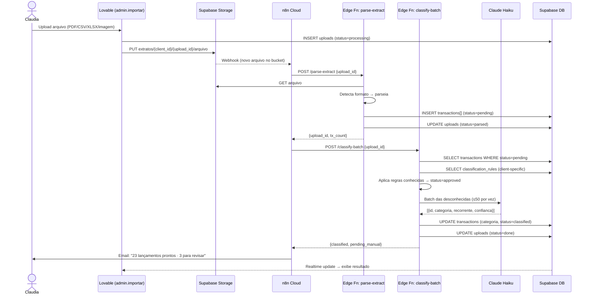

# Módulo 01 · Importação Inteligente de Extratos
### Plano de Execução e Testes — Aurora

> Sprint 1 · MVP  
> Projeto: IAP-DEMEO-2026-04

---

## Objetivo

Substituir o processo manual de classificação no IAMPA. Claudia faz upload do extrato → sistema parseia, classifica com IA e entrega os lançamentos prontos para revisão.

---

## Funcionalidades do Módulo

- Upload de PDF, CSV, XLSX e imagem — qualquer banco, qualquer formato
- Múltiplas contas por cliente (ex: Nubank + BB do mesmo cliente)
- IA estrutura cada lançamento: data, valor, descrição e tipo
- Histórico mantido — sistema aprende padrões entre meses (regras salvas)
- Fila de pendentes — processo nunca trava por nome desconhecido

---

## Arquitetura



---

## Etapas de Execução

### Etapa 1 — Supabase (via Cloud Lovable)

#### 1.1 Storage
- Criar bucket `extratos` (privado)
- Política: somente admin pode fazer upload

#### 1.2 Schema SQL

```sql
-- Bancos por cliente
CREATE TABLE client_banks (
  id UUID PRIMARY KEY DEFAULT gen_random_uuid(),
  client_id UUID REFERENCES clients(id) ON DELETE CASCADE,
  bank_name TEXT NOT NULL,
  UNIQUE(client_id, bank_name)
);

-- Uploads
CREATE TABLE uploads (
  id UUID PRIMARY KEY DEFAULT gen_random_uuid(),
  client_id UUID REFERENCES clients(id),
  bank_name TEXT NOT NULL,
  filename TEXT NOT NULL,
  storage_path TEXT NOT NULL,
  period TEXT NOT NULL,
  status TEXT DEFAULT 'processing',
  -- 'processing'|'parsed'|'classifying'|'done'|'error'
  tx_total INT DEFAULT 0,
  tx_classified INT DEFAULT 0,
  tx_pending INT DEFAULT 0,
  error_message TEXT,
  created_at TIMESTAMPTZ DEFAULT now()
);

-- Transações
CREATE TABLE transactions (
  id UUID PRIMARY KEY DEFAULT gen_random_uuid(),
  client_id UUID REFERENCES clients(id),
  upload_id UUID REFERENCES uploads(id) ON DELETE CASCADE,
  date DATE NOT NULL,
  description TEXT NOT NULL,
  raw_description TEXT,
  amount NUMERIC(14,2) NOT NULL,
  category TEXT,
  bank TEXT NOT NULL,
  status TEXT DEFAULT 'pending',
  -- 'pending'|'classified'|'approved'
  is_recurring BOOLEAN DEFAULT false,
  confidence INT,
  created_at TIMESTAMPTZ DEFAULT now()
);

-- Regras de classificação (aprendizado)
CREATE TABLE classification_rules (
  id UUID PRIMARY KEY DEFAULT gen_random_uuid(),
  client_id UUID REFERENCES clients(id),
  pattern TEXT NOT NULL,
  category TEXT NOT NULL,
  is_recurring BOOLEAN DEFAULT false,
  hit_count INT DEFAULT 0,
  created_at TIMESTAMPTZ DEFAULT now(),
  UNIQUE(client_id, pattern)
);

-- RLS
ALTER TABLE uploads ENABLE ROW LEVEL SECURITY;
ALTER TABLE transactions ENABLE ROW LEVEL SECURITY;
ALTER TABLE classification_rules ENABLE ROW LEVEL SECURITY;

-- Admin: acessa tudo
CREATE POLICY "admin_all_uploads" ON uploads FOR ALL
  USING (auth.jwt() ->> 'role' = 'admin');
CREATE POLICY "admin_all_transactions" ON transactions FOR ALL
  USING (auth.jwt() ->> 'role' = 'admin');

-- Cliente: só lê as próprias transações aprovadas
CREATE POLICY "client_read_transactions" ON transactions FOR SELECT
  USING (
    client_id = (auth.jwt() -> 'user_metadata' ->> 'client_id')::uuid
    AND status = 'approved'
  );
```

---

### Etapa 2 — Edge Functions (Supabase)

#### 2.1 `parse-extract`

Detecta o formato pelo nome do arquivo e normaliza para saída padrão:

```typescript
interface ParsedTransaction {
  date: string          // 'YYYY-MM-DD'
  description: string   // texto limpo
  raw_description: string
  amount: number        // positivo = receita, negativo = despesa
  bank: string
}
```

Mapeamento de bancos (CSV):

| Banco | Formato de data | Separador |
|-------|----------------|-----------|
| Itaú | DD/MM/AAAA | `;` |
| Bradesco | DD/MM/AAAA | `;` |
| Nubank | AAAA-MM-DD | `,` |
| Inter | DD/MM/AAAA | `,` |
| Banco do Brasil | DD/MM/AAAA | `\t` |

Lógica por formato:
- **CSV** → papaparse + normalização por banco
- **XLSX** → SheetJS / ExcelJS, lê primeira aba
- **PDF** → pdf-parse + regex por banco
- **Imagem** → Claude Vision (`claude-haiku-4-5`) extrai tabela

#### 2.2 `classify-batch`

Ordem de prioridade na classificação:

```
1. Match em classification_rules (ILIKE %pattern%) → status=approved
2. Lançamento recorrente do mês anterior → status=approved
3. Claude Haiku batch (≤50 por chamada):
   → confiança ≥ 70%: status=classified (aguarda aprovação da Claudia)
   → confiança < 70%: status=pending (fila manual)
```

Prompt Claude (compacto):
```
Classifique cada lançamento. SOMENTE JSON array de retorno.
Categorias: Receita · Vendas, Receita · Serviços, Receita · Delivery,
Despesa Fixa · Aluguel, Despesa Fixa · Salários, Despesa Fixa · Utilidades,
Despesa Variável · Insumos, Despesa Variável · Marketing,
Investimento · Equipamentos

[{"id":"tx1","desc":"ALUGUEL GALERIA","valor":-9200},...]

Retorne: [{"id":"tx1","cat":"Despesa Fixa · Aluguel","rec":true,"conf":95},...]
```

---

### Etapa 3 — n8n Cloud (Workflow: Extrato → Classificação)

Nodes em ordem:

```
[Trigger: Supabase Webhook]
  → evento: INSERT em uploads (status = processing)

[HTTP Request] POST /functions/v1/parse-extract
  body: { upload_id }

[Wait] 2s

[HTTP Request] POST /functions/v1/classify-batch
  body: { upload_id }

[IF] tx_pending > 0
  → TRUE:  Email "X classificados · Y precisam de revisão"
  → FALSE: Email "X lançamentos classificados automaticamente ✓"
```

---

### Etapa 4 — Lovable UI (`admin.importar.tsx`)

Substituições do mock atual:

| Mock hoje | Implementação real |
|-----------|-------------------|
| `setTimeout` simulando estágios | Supabase Realtime em `uploads.status` |
| `mockResultados` hardcoded | Query `transactions` por `upload_id` |
| Botão "Aprovar" sem ação | `UPDATE status=approved` + INSERT em `classification_rules` |
| Seleção de banco sem persistência | INSERT em `client_banks` |

Fluxo UI:
```
1. Claudia seleciona cliente + banco + arquivo
2. UI faz upload para Storage: extratos/{client_id}/{upload_id}/{filename}
3. UI faz INSERT em uploads → n8n detecta e inicia pipeline
4. Realtime subscription em uploads.status → atualiza estágios na tela
5. status=done → query transactions WHERE upload_id
6. Claudia revisa tabela de resultados
7. "Aprovar" individual → UPDATE status=approved
8. "Salvar como regra" → INSERT classification_rules
9. "Aprovar todos" → UPDATE status=approved em lote
```

---

## Plano de Testes

### Unitários (Vitest)

```typescript
// parsers/csv.test.ts
describe('Parser CSV', () => {
  it('Nubank (AAAA-MM-DD, vírgula)')
  it('Itaú (DD/MM/AAAA, ponto-e-vírgula)')
  it('Bradesco (DD/MM/AAAA, ponto-e-vírgula)')
  it('valor negativo = despesa')
  it('valor positivo = receita')
  it('ignora linhas de cabeçalho/saldo/total')
})

// ai/classify.test.ts
describe('Classificação', () => {
  it('aplica regra salva antes de chamar IA')
  it('confiança < 70% → status=pending')
  it('batch não ultrapassa 50 transações por chamada')
  it('salvar aprovação → INSERT classification_rules')
  it('mês seguinte: regra aplica automaticamente')
})
```

### Integração

| Cenário | Entrada | Esperado |
|---------|---------|----------|
| CSV Nubank válido | `nubank_abril.csv` | Lançamentos corretos, datas ISO |
| CSV Itaú com linhas de saldo | `itau_extrato.csv` | Linhas de saldo ignoradas |
| XLSX com múltiplas abas | `extrato.xlsx` | Lê somente primeira aba |
| PDF Bradesco (texto) | `bradesco.pdf` | Extrai via regex |
| Imagem legível | `foto_extrato.jpg` | Claude Vision extrai dados |
| Imagem ilegível | `foto_borrada.jpg` | status=error, mensagem clara |
| Nome desconhecido (PIX 4521) | Upload com PIX aleatório | status=pending, fila manual |
| Lançamento recorrente (2º mês) | Upload mês seguinte | Classifica sem chamar IA |
| Dois clientes, mesmo padrão | Uploads paralelos | Regras não vazam entre clientes |

### E2E (Playwright) — Fluxo Completo

```
1. Login como admin (Claudia)
2. Ir em Importar
3. Selecionar cliente Padaria São Jorge + banco Itaú
4. Upload de extrato_teste.csv
5. Aguardar Realtime: processing → parsed → classifying → done
6. Ver tabela de resultados com categorias
7. Aprovar lançamento classificado → status muda para approved
8. Editar categoria de lançamento pendente
9. Marcar como recorrente → salvar regra
10. Navegar para Pendentes → confirmar apenas os não aprovados
```

---

## Checklist — Definição de Pronto

- [ ] CSV dos 5 bancos principais parseia sem erro
- [ ] XLSX funcionando (ao menos 1 banco)
- [ ] PDF funcionando (ao menos Itaú ou Bradesco)
- [ ] Imagem via Claude Vision funcionando
- [ ] Classificação automática ≥ 80% dos recorrentes
- [ ] Desconhecidos vão para fila (nunca travam o sistema)
- [ ] Aprovar → salva regra → mês seguinte classifica automaticamente
- [ ] Status em tempo real na UI (sem refresh)
- [ ] Múltiplas contas do mesmo cliente no mesmo período
- [ ] RLS: cliente A não acessa dados do cliente B
- [ ] Testes unitários dos parsers passando

---

## Ordem de Construção (12 dias)

| Dia | Entrega |
|-----|---------|
| 1–2 | Schema SQL + Storage + RLS (Supabase via Cloud Lovable) |
| 3–4 | Edge Function `parse-extract` (CSV + XLSX) |
| 5 | n8n Workflow (trigger + orquestração) |
| 6–7 | Edge Function `classify-batch` (regras + Claude Haiku) |
| 8–9 | Lovable UI — substituir mock por Supabase real |
| 10 | Parser PDF + Claude Vision (imagem) |
| 11 | Testes de integração + ajustes |
| 12 | Call MVP com extratos reais da Claudia |

---

*Aurora · IAplicada · Sprint 1 · 2026*
