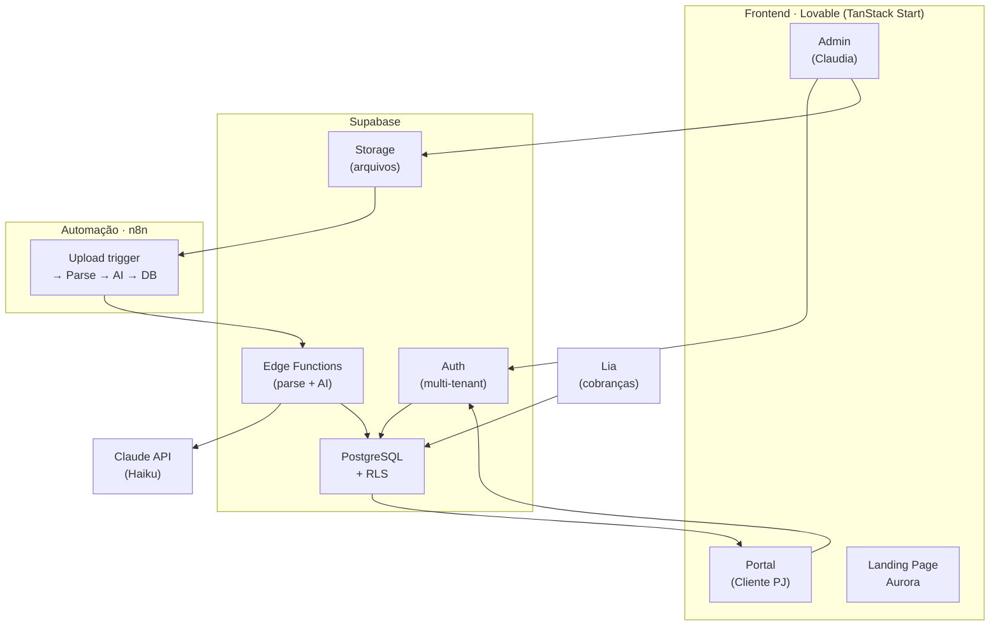
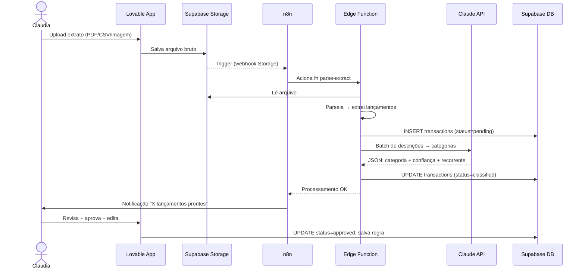
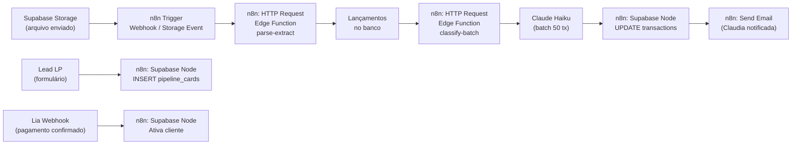

# Aurora · Plano de Execução Técnico


> Gerado em: junho 2026  
> Base: `demeo_completo.html` + análise do codebase `demeo-finance-hub`  
> Projeto: IAP-DEMEO-2026-04

---

## 1. Entendimento do Sistema

**Cliente:** Claudia — gestora financeira autônoma, 7 anos de experiência, 4 clientes ativos  
**Objetivo:** Plataforma própria para substituir o IAMPA, escalar de 4 para 20–30 clientes sem contratar equipe  
**Marca:** Aurora · Gestora Financeira

**Problema que resolve:**
- Processo 100% manual: coleta extrato → classifica no IAMPA → monta dashboard → envia para cliente
- Nome estranho paralisa o fechamento
- Impossível escalar além de 4–5 clientes sem comprometer qualidade

**Meta:** Claudia importa o extrato → sistema classifica → gera DFC/DRE → entrega portal ao cliente

**Atores:**
- **Claudia (admin)** — importa extratos, revisa pendentes, gerencia carteira, acompanha pipeline
- **Cliente PJ (portal)** — acessa próprio financeiro com login individual
- **IA (Claude Haiku)** — classifica lançamentos automaticamente
- **n8n** — orquestra o pipeline de automação pós-upload

---

## 2. Arquitetura Geral

```
┌─────────────────────────────────────────────────────────────┐
│                      Lovable Frontend                        │
│         (TanStack Start · shadcn/ui · 21st.dev)             │
│                                                             │
│   ┌─────────────┐   ┌──────────────┐   ┌───────────────┐  │
│   │  Admin App  │   │ Portal Cliente│   │  Landing Page │  │
│   │  (Claudia)  │   │  (PJ login)  │   │  (Aurora)     │  │
│   └──────┬──────┘   └──────┬───────┘   └───────────────┘  │
└──────────┼─────────────────┼───────────────────────────────┘
           │                 │
           ▼                 ▼
┌──────────────────────────────────────────────────────────────┐
│                        Supabase                              │
│                                                             │
│  ┌───────────────┐  ┌──────────────┐  ┌─────────────────┐  │
│  │  PostgreSQL    │  │  Auth (RLS)  │  │  Storage        │  │
│  │  (dados)       │  │  multi-tenant│  │  (extratos/PDFs)│  │
│  └───────────────┘  └──────────────┘  └─────────────────┘  │
│  ┌───────────────┐  ┌──────────────┐                        │
│  │  Edge Functions│  │  Realtime    │                        │
│  │  (parser/AI)  │  │  (status live)│                        │
│  └──────┬────────┘  └──────────────┘                        │
└─────────┼────────────────────────────────────────────────────┘
          │
┌─────────▼─────────────────────────────────┐
│              n8n (Automações)           │
│  Upload → Parse → Classify → Notify       │
└─────────────────────────────────────────────┘
          │
     ┌────▼────────┐    ┌─────────────┐
     │ Claude API   │    │   Lia       │
     │ (Haiku)      │    │ (cobranças) │
     └─────────────┘    └─────────────┘
```

**Mermaid:**



---

## 3. Stack Definida

| Camada | Tecnologia | Papel |
|--------|-----------|-------|
| Frontend | Lovable + TanStack Start (React 19) | Telas do sistema, LP, portal cliente |
| UI Components | shadcn/ui + 21st.dev | Design system, componentes visuais |
| Styling | Tailwind v4 + tokens Aurora | Paleta linho/verde/navy definida no brandbook |
| Banco de dados | Cloud Lovable (Supabase gerenciado pelo Lovable) | Multi-tenant com RLS por cliente |
| Auth | Supabase Auth (via Lovable) | Login admin + portal cliente (roles) |
| Storage | Supabase Storage (via Lovable) | Extratos enviados + PDFs gerados |
| Backend logic | Supabase Edge Functions (Deno) | Parsing de extratos, geração de relatórios |
| Automação | n8n (self-hosted ou Cloud) | Orquestração: upload → parse → IA → notificação |
| IA Classificação | Claude claude-haiku-4-5 | Classificação de lançamentos (batch) |
| Cobranças | Lia | Gestão de pagamentos dos clientes da Claudia |
| Versionamento | GitHub | Código-fonte transferido ao final |
| Referência visual | ascone-finance.webflow.io | Aprovado pela Claudia |

> **Nota sobre o codebase atual:** O repositório `demeo-finance-hub` é o protótipo construído no Lovable com dados mock. Está rodando em https://demeo-finance-hub.lovable.app/. Toda a estrutura de telas está pronta — o trabalho agora é conectar o backend real.
>
> **Cloud Lovable (banco de dados):** O Supabase é provisionado e gerenciado diretamente pelo Lovable via "Connect to Supabase" no painel. Isso significa que as variáveis de ambiente (`SUPABASE_URL`, `SUPABASE_ANON_KEY`) são injetadas automaticamente pelo Lovable, e as migrations podem ser aplicadas diretamente pela interface. Não é necessário criar o projeto manualmente no supabase.com.

---

## 4. Fluxo Principal — Importação e Classificação



---

## 5. Os 6 Módulos — Escopo e Arquitetura

### Módulo 01 · Importação Inteligente (Sprint 1 — MVP)
**Problema:** Fim do processo manual no IAMPA  
**Features:**
- Upload drag-and-drop: PDF, CSV, XLSX, imagem
- Múltiplas contas por cliente (ex: Nubank + BB do mesmo cliente)
- IA estrutura: data, valor, descrição, tipo de cada lançamento
- Interface de lançamento manual (clientes que usam dinheiro em espécie)
- Histórico mantido — sistema aprende padrões entre meses

**Arquitetura:**
```
Upload → Supabase Storage → n8n trigger → Edge Function:
  PDF: pdf-parse (extrai texto) → regex por banco
  CSV: papaparse → normaliza colunas
  XLSX: ExcelJS → lê planilha
  Imagem: Claude Vision (describe + extract)
→ Normaliza para {date, amount, description, bank}
→ INSERT transactions
```

### Módulo 02 · Motor de Classificação (Sprint 1 — MVP)
**Problema:** Nome estranho não paralisa mais o fechamento  
**Features:**
- Plano de contas individual por cliente
- Regras configuráveis: fornecedor X → categoria Y
- Aprendizado contínuo — aprende nas próximas importações
- Fila de pendentes — processo nunca trava

**Arquitetura:**
```
Lançamentos novos → lookup em classification_rules (client-specific)
  → regra encontrada: aplica categoria, status=approved
  → sem regra: chama Claude Haiku (batch de até 50)
    → confiança >= 70%: status=classified (aguarda aprovação)
    → confiança < 70%: status=pending (fila manual)
Claudia aprova → salva como regra para próximo mês
```

### Módulo 03 · DFC Automática + Dashboard (Sprint 2)
**Problema:** Fim da montagem manual do dashboard  
**Features:**
- DFC gerada automaticamente dos lançamentos classificados
- Projeção 30/60/90 dias com base em recorrências
- Gestão de parcelamentos no cartão (cada parcela no mês correto)
- Exportação PDF e Excel para a reunião de fechamento

**Arquitetura:**
```
SQL: GROUP BY category, period, client_id
→ receitas, despesas, resultado por categoria/semana/mês
→ projeção: média ponderada das últimas 3 ocorrências de recorrentes
→ parcelamentos: tabela card_installments com data_vencimento
→ PDF: @react-pdf/renderer (Edge Function)
→ Excel: ExcelJS (Edge Function)
```

### Módulo 04 · Painel Multi-cliente Admin (Sprint 2)
**Problema:** Com 20–30 clientes é impossível controlar na cabeça  
**Features:**
- Status de fechamento de cada cliente: pendente / em andamento / fechado
- Lista de pendências de todos os clientes em uma tela
- Calendário de fechamentos mensais com alertas
- Histórico completo por cliente

**Arquitetura:**
```
Dashboard Claudia: query clients com JOINs em transactions/uploads
→ status calculado: 0 pending = Fechado, >0 = em andamento
→ alertas: client.last_upload > 35 dias = alerta
→ Supabase Realtime: status muda em tempo real
```

### Módulo 05 · Portal do Cliente (Sprint 3)
**Problema:** Diferencial competitivo + possível receita adicional  
**Features:**
- Login individual — cada empresário vê só o próprio financeiro
- Sub-usuários por empresa (dono + financeiro)
- DFC/DRE em tempo real sem depender de relatório enviado
- Claudia define o que cada cliente pode visualizar
- Download de PDF e Excel direto pelo cliente

**Arquitetura:**
```
Supabase Auth: role=client, vinculado a client_id via user_metadata
RLS Policy: transactions.client_id = auth.jwt().client_id
Portal routes: /portal (já prototipado no Lovable)
Permissões: clients.portal_features JSONB { dfc: bool, projecao: bool, download: bool }
```

### Módulo 06 · Funil de Captação + CRM (Sprint 3–4)
**Problema:** Sair da dependência de indicações  
**Features:**
- Landing page Aurora no ar (em paralelo com Sprint 1)
- Formulário → lead cai automaticamente no CRM
- Pipeline: lead → diagnóstico → proposta → fechado
- Proposta e contrato automático em PDF
- Análise de precificação por serviço

**Arquitetura:**
```
LP (Lovable): formulário → n8n → INSERT pipeline_cards
CRM: kanban visual (já prototipado) → UPDATE stage
Proposta: template HTML preenchido + Supabase Edge Function → PDF → Storage
Lia webhook: pagamento confirmado → cliente ativado no sistema
```

---

## 6. Modelo de Dados — Supabase

```sql
-- CLIENTES
CREATE TABLE clients (
  id UUID PRIMARY KEY DEFAULT gen_random_uuid(),
  name TEXT NOT NULL,
  owner_name TEXT NOT NULL,
  cnpj TEXT,
  status TEXT DEFAULT 'Em andamento', -- 'Fechado'|'Pendente'|'Em andamento'
  portal_features JSONB DEFAULT '{"dfc":true,"projecao":false,"download":false}',
  last_upload_at TIMESTAMPTZ,
  created_at TIMESTAMPTZ DEFAULT now()
);

-- USUÁRIOS DO SISTEMA (espelho do Supabase Auth)
CREATE TABLE user_profiles (
  id UUID PRIMARY KEY REFERENCES auth.users(id),
  role TEXT NOT NULL, -- 'admin' | 'client'
  client_id UUID REFERENCES clients(id),
  name TEXT
);

-- BANCOS POR CLIENTE
CREATE TABLE client_banks (
  id UUID PRIMARY KEY DEFAULT gen_random_uuid(),
  client_id UUID REFERENCES clients(id) ON DELETE CASCADE,
  bank_name TEXT NOT NULL
);

-- UPLOADS DE EXTRATOS
CREATE TABLE uploads (
  id UUID PRIMARY KEY DEFAULT gen_random_uuid(),
  client_id UUID REFERENCES clients(id),
  bank_name TEXT NOT NULL,
  filename TEXT NOT NULL,
  storage_path TEXT NOT NULL,
  period TEXT NOT NULL,  -- '04/2026'
  status TEXT DEFAULT 'processing', -- 'done'|'error'|'processing'
  transaction_count INT,
  created_at TIMESTAMPTZ DEFAULT now()
);

-- TRANSAÇÕES
CREATE TABLE transactions (
  id UUID PRIMARY KEY DEFAULT gen_random_uuid(),
  client_id UUID REFERENCES clients(id),
  upload_id UUID REFERENCES uploads(id),
  date DATE NOT NULL,
  description TEXT NOT NULL,
  raw_description TEXT,
  amount NUMERIC NOT NULL,
  category TEXT,
  bank TEXT NOT NULL,
  status TEXT DEFAULT 'pending', -- 'pending'|'classified'|'approved'
  is_recurring BOOLEAN DEFAULT false,
  confidence INT, -- 0-100 da IA
  created_at TIMESTAMPTZ DEFAULT now()
);

-- REGRAS DE CLASSIFICAÇÃO (aprendizado)
CREATE TABLE classification_rules (
  id UUID PRIMARY KEY DEFAULT gen_random_uuid(),
  client_id UUID REFERENCES clients(id),
  pattern TEXT NOT NULL,       -- substring da descrição (ILIKE)
  category TEXT NOT NULL,
  is_recurring BOOLEAN DEFAULT false,
  hit_count INT DEFAULT 0,
  created_at TIMESTAMPTZ DEFAULT now()
);

-- PARCELAMENTOS NO CARTÃO
CREATE TABLE card_installments (
  id UUID PRIMARY KEY DEFAULT gen_random_uuid(),
  client_id UUID REFERENCES clients(id),
  description TEXT NOT NULL,
  total_amount NUMERIC NOT NULL,
  installments INT NOT NULL,
  start_date DATE NOT NULL,
  category TEXT
);

-- RELATÓRIOS GERADOS
CREATE TABLE reports (
  id UUID PRIMARY KEY DEFAULT gen_random_uuid(),
  client_id UUID REFERENCES clients(id),
  period TEXT NOT NULL,
  type TEXT NOT NULL,           -- 'DFC'|'DRE'|'DFC+DRE'
  storage_path TEXT NOT NULL,
  generated_at TIMESTAMPTZ DEFAULT now()
);

-- PIPELINE CRM
CREATE TABLE pipeline_cards (
  id UUID PRIMARY KEY DEFAULT gen_random_uuid(),
  name TEXT NOT NULL,
  source TEXT,                  -- 'Indicação'|'Landing page'|'Instagram'
  stage TEXT NOT NULL,          -- 'lead'|'contato'|'diag'|'prop'|'ganho'|'perdido'
  expected_value NUMERIC,
  notes TEXT,
  created_at TIMESTAMPTZ DEFAULT now()
);

-- ROW LEVEL SECURITY
ALTER TABLE clients ENABLE ROW LEVEL SECURITY;
ALTER TABLE transactions ENABLE ROW LEVEL SECURITY;
ALTER TABLE reports ENABLE ROW LEVEL SECURITY;

-- Admin: acessa tudo
CREATE POLICY "admin_all" ON clients FOR ALL USING (
  EXISTS (SELECT 1 FROM user_profiles WHERE id = auth.uid() AND role = 'admin')
);

-- Cliente: só vê o próprio
CREATE POLICY "client_own" ON transactions FOR SELECT USING (
  client_id = (SELECT client_id FROM user_profiles WHERE id = auth.uid())
);
```

---

## 7. Automações n8n



> **n8n vs n8n Cloud:** Para o MVP pode-se usar o n8n Cloud (gratuito até 5 workflows ativos). Para produção com mais clientes, o self-hosted no Railway ou Render é mais econômico (~$5/mês).

---

## 8. Roadmap por Sprints

### Sprint 0 — ✅ Concluído (15/04/2026)
- Protótipo Lovable construído com dados mock
- Brandbook Aurora finalizado
- Documento unificado do projeto entregue
- Stack definida

### Sprint 1 — Próximo (MVP · 1,5–2 semanas)
**Mariana constrói:**
- [ ] Setup Supabase: schema SQL, RLS, auth
- [ ] Conectar Lovable ao Supabase (substituir mockData.ts)
- [ ] Tela de login Aurora funcional (Supabase Auth)
- [ ] Upload de extratos → Supabase Storage
- [ ] Edge Function: parser CSV (básico)
- [ ] n8n: trigger upload → parse → IA
- [ ] Edge Function: classificação Claude Haiku
- [ ] Tela Pendentes: aprovar + salvar regra (funcional)
- [ ] Landing page Aurora no Lovable

**Claudia fornece:**
- [ ] Extratos reais do cliente piloto (3 meses)
- [ ] Plano de contas atual
- [ ] 3 documentos da call (DR Executivo, template, planilha)
- [ ] Textos da landing page
- [ ] Escolha do descritor (Opções 01–04)

**Validação conjunta (call MVP):**
- [ ] Sistema funcionando com extratos reais
- [ ] Classificações corretas vs. IAMPA
- [ ] Layout da landing page aprovado

### Sprint 2 — DFC + Admin (1,5–2 semanas)
- [ ] DFC calculada automaticamente do banco
- [ ] Fluxo semanal por cliente
- [ ] Projeção 30/60/90 dias
- [ ] Gestão de parcelamentos no cartão
- [ ] Exportação PDF (Edge Function)
- [ ] Exportação Excel
- [ ] Painel admin com status real de todos os clientes
- [ ] Calendário de fechamentos + alertas

### Sprint 3 — Portal + Funil (1,5 semanas)
- [ ] Portal cliente com auth Supabase (RLS por client_id)
- [ ] Sub-usuários por empresa
- [ ] Permissões por cliente (o que cada um pode ver)
- [ ] CRM integrado: formulário LP → n8n → pipeline_cards
- [ ] Proposta automática em PDF
- [ ] Integração Lia (webhook ativa cliente)

### Sprint 4 — Entrega Final (~1 semana)
- [ ] Migração dos 4 clientes atuais para o sistema
- [ ] Tutoriais gravados por módulo
- [ ] Guia prático completo
- [ ] Transferência Supabase + repositório GitHub
- [ ] Encerramento do IAMPA
- [ ] Planejamento Fase 2 (opcional)

---

## 9. Fase 2 — Módulos Futuros

### Cérebro Cláudia — Agente IA (Ref. R$2.000)
- Agente com contexto operacional completo da carteira
- Alertas de oportunidade e anomalias por cliente
- Assistente virtual integrado ao sistema
- Indicação de cliente = implementação gratuita

### Insights Estratégicos com IA (Ref. R$2.000)
- Relatórios de análise estratégica automáticos
- Identificação de padrões e gargalos no fluxo financeiro
- Sugestões de ação baseadas no histórico

---

## 10. QA e Testes

### Pirâmide
```
        /\
       /E2E\        Playwright — upload → aprovação → DFC
      /------\
     /Integração\   Vitest — Edge Functions, RLS, classificação
    /------------\
   / Unitários    \  Vitest — parsers, cálculos DFC, batch IA
  /______________\
```

**Casos críticos:**
1. CSV do Itaú → lançamentos corretos extraídos
2. PDF com nome desconhecido → vai para fila de pendentes
3. Aprovação → salva como regra → próximo extrato classifica automaticamente
4. DFC: receitas − despesas = resultado correto
5. Cliente A não consegue ver dados do Cliente B (RLS)
6. Portal cliente: não acessa menu admin

**CI (GitHub Actions):**
```yaml
on: [push, pull_request]
jobs:
  test:
    - bun install
    - bun run lint
    - bun run test
  e2e:
    - bunx playwright test
```

---

## 11. Riscos

| Risco | Nível | Mitigação |
|-------|-------|-----------|
| Parsing PDF: cada banco tem formato diferente | Alto | Começar com CSV/XLSX; PDFs por banco adicionados iterativamente |
| Nomes de transações ambíguos (PIX 4521) | Alto | Fila de pendentes bem projetada — Claudia valida uma vez, regra salva para sempre |
| Custo Claude API escalando | Médio | Batch de 50 tx por chamada + cache de regras = <R$1/cliente/mês |
| Supabase free tier (500MB DB, 1GB storage) | Médio | Suficiente para MVP; plano Pro (~$25/mês) quando chegar a 10+ clientes |
| Lançamentos em espécie sem padrão | Médio | Interface de entrada manual bem projetada; Claudia preenche via áudio → IA estrutura |
| LGPD — dados financeiros de PMEs | Alto | Supabase (GDPR compliant) + RLS + não armazenar dados de cartão |
| Clientes com múltiplos bancos e formatos misturados | Médio | Upload múltiplo por período, bank_name por arquivo |

---

## 12. Estrutura de Pastas

```
demeo-finance-hub/
├── src/
│   ├── routes/                    # TanStack Router (Lovable)
│   │   ├── admin.*/               # ✅ Telas prontas, precisam de dados reais
│   │   ├── portal.tsx             # ✅ Pronto, precisa de auth real
│   │   └── login.tsx              # Precisa integrar Supabase Auth
│   ├── components/
│   │   ├── AdminLayout.tsx        # ✅ Pronto
│   │   └── ui/                    # shadcn/ui components
│   ├── lib/
│   │   ├── supabase.ts            # ← CRIAR: client Supabase
│   │   ├── queries/               # ← CRIAR: queries tipadas por entidade
│   │   │   ├── clients.ts
│   │   │   ├── transactions.ts
│   │   │   └── reports.ts
│   │   ├── ai/
│   │   │   └── classify.ts        # ← CRIAR: batch Claude Haiku
│   │   ├── parsers/
│   │   │   ├── csv.ts             # ← CRIAR
│   │   │   ├── pdf.ts             # ← CRIAR (sprint 2)
│   │   │   └── xlsx.ts            # ← CRIAR
│   │   └── mockData.ts            # 🗑 Remover após integração
│   └── types/
│       └── database.types.ts      # ← GERAR: supabase gen types
├── supabase/
│   ├── migrations/
│   │   └── 0001_initial.sql       # ← CRIAR: schema completo
│   └── functions/
│       ├── parse-extract/         # ← CRIAR: Edge Function parsing
│       │   └── index.ts
│       └── classify-batch/        # ← CRIAR: Edge Function IA
│           └── index.ts
├── .env.local                     # SUPABASE_URL + SUPABASE_ANON_KEY
└── PLANO_EXECUCAO.md              # Este arquivo
```

### Snippet de partida — Supabase Client

```typescript
// src/lib/supabase.ts
import { createClient } from '@supabase/supabase-js'
import type { Database } from '@/types/database.types'

export const supabase = createClient<Database>(
  import.meta.env.VITE_SUPABASE_URL,
  import.meta.env.VITE_SUPABASE_ANON_KEY
)
```

### Snippet — Edge Function · Classificação

```typescript
// supabase/functions/classify-batch/index.ts
import Anthropic from 'npm:@anthropic-ai/sdk'

Deno.serve(async (req) => {
  const { transactions } = await req.json()
  const client = new Anthropic()

  const { content } = await client.messages.create({
    model: 'claude-haiku-4-5-20251001',
    max_tokens: 2048,
    messages: [{
      role: 'user',
      content: `Classifique os lançamentos. Retorne JSON array: [{id, categoria, recorrente, confianca}].
      
Categorias: ${CATEGORIAS.join(', ')}

Lançamentos: ${JSON.stringify(transactions)}

SOMENTE o JSON array, sem texto extra.`
    }]
  })

  const result = JSON.parse(content[0].type === 'text' ? content[0].text : '[]')
  return Response.json({ classifications: result })
})
```

---

## 13. Próximas Ações Imediatas

**Esta semana:**
- [ ] No Lovable: clicar em **"Connect to Supabase"** → provisiona o banco automaticamente
- [ ] Aplicar `0001_initial.sql` via painel do Lovable (ou editor SQL do Supabase)
- [ ] Gerar types TypeScript: `supabase gen types typescript --project-id <id>`
- [ ] Criar `src/lib/supabase.ts` (o Lovable já injeta as env vars)
- [ ] Substituir primeiro `mockData.ts` pela query real de clientes
- [ ] Iniciar Landing Page Aurora no Lovable
- [ ] n8n: configurar trigger de upload no Storage

**Claudia envia (urgente para MVP):**
- [ ] Extratos reais (3 meses, cliente piloto)
- [ ] Plano de contas atual
- [ ] 3 documentos da call
- [ ] Escolha do descritor Aurora (01 a 04)

**Semana que vem (call MVP):**
- [ ] Sistema rodando com extratos reais
- [ ] Classificações validadas vs IAMPA
- [ ] LP aprovada antes de publicar

---

*Aurora × IAplicada · 2026*
