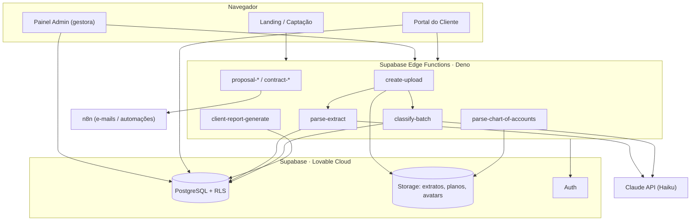
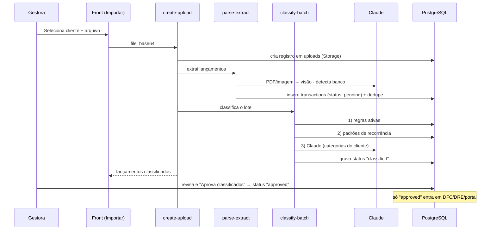

# Aurora · Gestão Financeira

Plataforma de gestão financeira terceirizada para escritórios e pequenas empresas.
A Aurora permite que uma gestora financeira administre, num só lugar, as finanças de
múltiplos clientes — da **importação de extratos bancários com classificação por IA**
até **DFC/DRE**, **fechamento mensal**, **portal do cliente** e um **CRM comercial**
(propostas e contratos).

> **Produção:** [auroragfe.com](https://auroragfe.com) · Repositório privado · Uso interno Aurora.

---

## Índice

- [Visão geral](#visão-geral)
- [Funcionalidades](#funcionalidades)
- [Arquitetura](#arquitetura)
- [Stack](#stack)
- [Pipeline de importação](#pipeline-de-importação)
- [Estrutura do projeto](#estrutura-do-projeto)
- [Modelo de dados](#modelo-de-dados)
- [Edge Functions](#edge-functions)
- [Começando](#começando)
- [Variáveis de ambiente](#variáveis-de-ambiente)
- [Testes](#testes)
- [Deploy](#deploy)
- [Segurança](#segurança)
- [Convenções](#convenções)

---

## Visão geral

**Problema.** Uma gestora financeira que atende várias empresas gasta horas
consolidando extratos de bancos diferentes, categorizando lançamentos à mão e
montando relatórios gerenciais por cliente.

**Solução.** A Aurora centraliza esse trabalho:

- **Painel administrativo** (a gestora) — importa extratos, revisa a classificação
  automática, acompanha DFC/DRE e fecha o mês de cada cliente.
- **Portal do cliente** — cada empresa acompanha seus próprios números (com
  funcionalidades liberadas por plano e sub-perfis de acesso).
- **Motor de classificação** — regras, recorrência e IA (Claude) categorizam os
  lançamentos automaticamente; nada entra nos relatórios sem **aprovação manual**.

**Atores**

| Ator | Papel |
|------|-------|
| **Gestora / Admin** | Importa e revisa lançamentos, gerencia clientes, plano de contas, DFC/DRE, propostas e contratos. |
| **Cliente (owner)** | Acesso total ao portal da própria empresa. |
| **Cliente (financeiro)** | Acesso ao portal com escopo reduzido. |

---

## Funcionalidades

### Financeiro
- **Importação de extratos** — CSV, XLSX, PDF e imagem; detecção automática do banco
  pelo conteúdo do arquivo; deduplicação de lançamentos reimportados.
- **Classificação automática em 3 camadas** — regras ativas → padrões de recorrência
  → Claude Haiku (com contexto do setor e do plano de contas do cliente).
- **Revisão obrigatória** — a IA marca os lançamentos como *classificados*; só entram
  em relatórios/portal após **aprovação manual** da gestora.
- **Plano de Contas por cliente** — upload do plano contábil (XLSX/CSV) que vira as
  categorias usadas pela IA e replica automaticamente todos os meses.
- **Categorias e Regras de Classificação** — configuráveis por cliente.
- **DFC Gerencial e DRE** — por cliente e período, com projeção de fluxo de caixa.
- **Fechamento mensal, Detalhamento e Relatórios** — exportação em **PDF** e **Excel**.
- **Contas a pagar** e **lançamentos parcelados**.

### Portal do cliente
- Dashboard financeiro, DFC/DRE e relatórios da própria empresa.
- Funcionalidades liberadas por plano (`portal_features`) e sub-perfis (owner/financeiro).
- Geração de relatório executivo em PDF.

### Comercial (CRM)
- **Pipeline** de negócios (funil com arrastar-e-soltar entre etapas).
- **Propostas** e **contratos** com numeração automática, envio por e-mail (n8n) e
  aceite/assinatura via link com token; expiração automática de propostas.
- **Precificação** — histórico de preços de serviços e insights.
- **Landing page** com captação de leads.

### Plataforma
- Autenticação e autorização com RLS por papel.
- Notificações web push.
- Observabilidade: logs, contadores e limitação de taxa (rate limit).

---

## Arquitetura



O front-end lê dados diretamente do PostgreSQL via `@supabase/supabase-js` (protegido
por **Row Level Security**) e usa **Edge Functions** para operações que exigem
`service_role`, IA ou integrações externas.

---

## Stack

| Camada | Tecnologia | Por quê |
|--------|-----------|---------|
| **Frontend** | React 19 + TanStack Router/Start | Roteamento por arquivos, type-safe, SSR-ready. |
| **Build** | Vite 7 (`@lovable.dev/vite-tanstack-config`) | Configuração unificada da Lovable. |
| **UI** | Tailwind CSS v4, Radix UI, Framer Motion, Recharts | Design system consistente, acessível e animado. |
| **Estado/Dados** | TanStack Query, react-hook-form, Zod | Cache de dados e validação de formulários. |
| **Backend** | Supabase (PostgreSQL, Auth, Storage, Edge Functions/Deno) | BaaS integrado ao Lovable Cloud. |
| **IA** | Claude `claude-haiku-4-5` (Anthropic) | Extração de PDF/imagem (visão) e classificação de lançamentos. |
| **Automações** | n8n | Envio de propostas/contratos e notificações. |
| **Planilhas** | `xlsx` (SheetJS) | Parse de XLSX/CSV e exportação Excel. |
| **Deploy** | Lovable Cloud | Hospedagem do front + banco + funções. |

---

## Pipeline de importação

O fluxo mais crítico do sistema — do upload do extrato à aprovação:



**Estados de um lançamento:** `pending` (sem categoria → tela Pendentes) →
`classified` (categorizado pela IA, aguardando aprovação) → `approved`
(aprovado pela gestora, visível em relatórios e no portal).

---

## Estrutura do projeto

```
.
├── src/
│   ├── routes/               # Rotas (TanStack file-based routing)
│   │   ├── index.tsx         # Landing page
│   │   ├── login.tsx
│   │   ├── admin.*.tsx       # Painel da gestora (dashboard, clientes, DFC, importar…)
│   │   ├── portal.tsx        # Portal do cliente
│   │   └── p.proposta.$token.tsx  # Aceite público de proposta
│   ├── components/           # Componentes (AdminLayout, painéis DFC/DRE, drawers…)
│   ├── hooks/                # useCategories, useDFCForecast, usePushNotifications…
│   ├── lib/                  # supabase, auth, dre, healthScore, utils…
│   └── routeTree.gen.ts      # Árvore de rotas (gerada pelo plugin)
├── supabase/
│   ├── functions/            # 23 Edge Functions (Deno) + _shared/
│   └── migrations/           # Migrações SQL (schema, RLS, triggers, seeds)
├── public/                   # Assets estáticos + service worker (push)
├── vite.config.ts
└── package.json
```

---

## Modelo de dados

Principais entidades (PostgreSQL, todas com RLS):

**Financeiro**
- `clients`, `client_banks` — clientes e seus bancos.
- `uploads` — arquivos de extrato importados (status, período, contadores).
- `transactions` — lançamentos (`status`, `category`, `is_recurring`, parcelas).
- `categories` — plano de contas do cliente (com `code` contábil hierárquico).
- `classification_rules`, `recurrence_patterns` — motor de classificação.
- `chart_of_accounts_uploads` — histórico dos planos de contas enviados.
- `monthly_closings`, `monthly_revenue_entries` — fechamento mensal.
- `report_exports` — histórico de PDFs/Excel gerados.
- `payables` — contas a pagar.

**Comercial**
- `leads`, `lead_sources` — captação.
- `deals`, `deal_stages`, `deal_stage_history`, `deal_activities` — pipeline.
- `proposals`, `proposal_items`, `contracts` — documentos.
- `services`, `service_price_history` — catálogo e precificação.
- `document_counters` — numeração sequencial de documentos.

**Plataforma**
- `profiles`, `user_roles`, `user_client_mapping` — identidade e autorização.
- `push_subscriptions` — notificações web push.
- `rate_limit_hits` — limitação de taxa.

---

## Edge Functions

| Função | Responsabilidade |
|--------|------------------|
| `create-upload` | Orquestra o upload: Storage → `parse-extract` → `classify-batch`. |
| `parse-extract` | Extrai lançamentos (CSV/XLSX por colunas, PDF/imagem via Claude), detecta o banco. |
| `classify-batch` | Classifica em 3 camadas (regras → recorrência → Claude). |
| `parse-chart-of-accounts` | Lê o plano de contas (XLSX/CSV) e alimenta as categorias do cliente. |
| `client-report-generate` | Gera o relatório executivo do cliente. |
| `pending-count` / `pipeline-kpis` | Contadores e KPIs. |
| `proposal-generate/send/view/accept` · `expire-proposals` | Ciclo de vida das propostas. |
| `contract-generate/send` | Geração e envio de contratos. |
| `deal-move` | Movimentação no funil. |
| `lead-intake` | Captação de leads (landing). |
| `analyze-client` | Análise financeira assistida por IA. |
| `create-admin-user` / `create-client-user` | Provisionamento de usuários. |
| `subscribe-push` / `send-push` | Notificações web push. |
| `expire-stale-rules` · `status` | Manutenção e healthcheck. |

O CORS de todas as funções é centralizado em `supabase/functions/_shared/cors.ts`.

---

## Começando

### Pré-requisitos
- **Node.js ≥ 22.12** (exigência do Vite 7)
- **npm** (ou **bun**)
- Projeto Supabase / Lovable Cloud com as variáveis de ambiente configuradas

### Instalação

```bash
npm install
```

### Desenvolvimento

```bash
npm run dev        # servidor de desenvolvimento (Vite)
npm run build      # build de produção
npm run preview    # pré-visualiza o build
npm run lint       # ESLint
npm run format     # Prettier
```

---

## Variáveis de ambiente

**Frontend (`.env`, prefixo `VITE_`)**

| Variável | Descrição |
|----------|-----------|
| `VITE_SUPABASE_URL` | URL do projeto Supabase. |
| `VITE_SUPABASE_ANON_KEY` / `VITE_SUPABASE_PUBLISHABLE_KEY` | Chave pública (anon). |
| `VITE_AURORA_APP_URL` | URL pública da aplicação. |

**Edge Functions (secrets no Supabase/Lovable)**

| Variável | Uso |
|----------|-----|
| `SUPABASE_URL`, `SUPABASE_SERVICE_ROLE_KEY` | Acesso privilegiado ao banco. |
| `ANTHROPIC_API_KEY` | Claude (parse-extract, classify-batch, analyze-client). |
| `N8N_WEBHOOK_URL` | Webhook de automações. |
| `RESEND_API_KEY`, `AURORA_NOTIFY_FROM`, `AURORA_NOTIFY_TO` | Envio de e-mails/alertas. |
| `VAPID_PUBLIC_KEY`, `VAPID_PRIVATE_KEY`, `VAPID_SUBJECT` | Web push. |
| `TURNSTILE_SECRET` | Anti-bot no formulário de leads. |
| `AURORA_APP_URL`, `STATUS_TOKEN`, `ALERT_WEBHOOK_URL` | Links, healthcheck e alertas. |

> Qualquer domínio novo que sirva o front precisa ser adicionado à lista de origens em
> `supabase/functions/_shared/cors.ts` — e **todas as Edge Functions redeployadas**,
> pois o arquivo compartilhado é embutido em cada função no deploy.

---

## Testes

A suíte segue a pirâmide **unit → integração → E2E** (Jest + Playwright):

```bash
npm run test              # unitários (tests/unit)
npm run test:integration  # integração (tests/integration)
npm run test:e2e          # end-to-end (Playwright)
npm run test:all          # tudo
```

---

## Deploy

O deploy é feito pela **Lovable Cloud**:

1. Merge na branch `main`.
2. **Migrações** SQL aplicadas via Lovable/dashboard (não CLI local).
3. **Edge Functions** deployadas pela Lovable — ao alterar `_shared/*`, redeployar as
   funções afetadas.
4. O front sobe automaticamente no build.

---

## Segurança

- **Row Level Security** em todas as tabelas; políticas por papel (`is_admin()`,
  mapeamento usuário↔cliente).
- Buckets de Storage **privados** (`extratos`, `planos`, `avatars`) com acesso via
  URL assinada.
- Segredos apenas em variáveis de ambiente; `service_role` restrito às Edge Functions.
- Rate limiting e proteção anti-bot (Turnstile) na captação de leads.

---

## Convenções

- **Git:** nunca commitar direto na `main` — sempre branch + Pull Request.
- **Modularidade:** hooks para data fetching, Edge Functions com responsabilidade única,
  UI sem acesso direto a segredos.
- **Código legível:** siga o estilo do arquivo vizinho (nomes, densidade de comentários,
  idioma pt-BR na UI).

---

<p align="center"><sub>© Aurora Gestão Financeira · 2026</sub></p>
